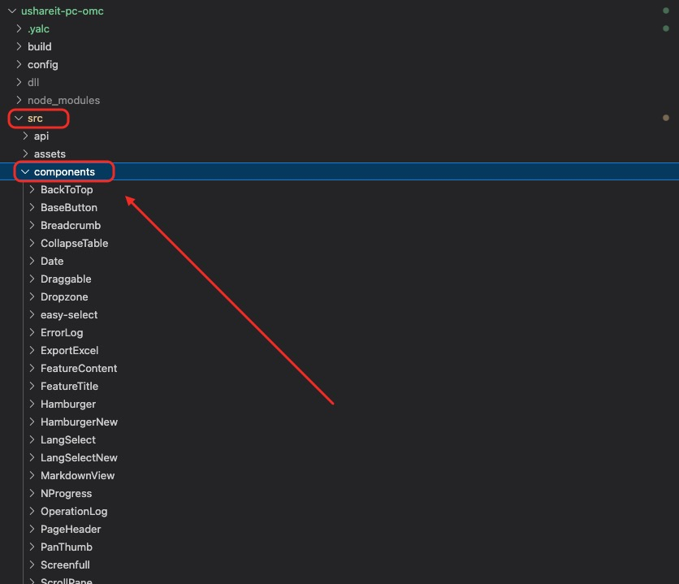

## OMC组件我们大致分为三部分

- 项目自集成components组件
- [前端基础组件库](http://web.payermax.inner/component-docs/manage/)
- 自定义组件

### 一、集成的components

微应用```src -> components ``` 目录下的所有组件；


### 二、前端基础组件库
👉  [前端开发的组件库的组件](http://web.payermax.inner/component-docs/)


### 三、自定义组件

这部分属于自己开发组件书写的内容；

👉 **希望循序一下规范开发**

#### 1、组件命名规范
1. **组件文件名**
   - 组件文件名应该采用大驼峰命名法（PascalCase），并且文件名应该与组件的名称保持一致。例如，一个名为`UserProfile`的组件，其文件名应该是`UserProfile.vue`。这样可以提高代码的可读性，方便在项目文件结构中快速定位组件。
2. **组件名在Vue实例中**
   - 在Vue实例（`new Vue()`）或者其他组件中使用组件时，组件的注册名也应该采用大驼峰命名法。例如：
   ```javascript
   // 全局注册
   Vue.component('UserProfile', UserProfile);
   // 或者局部注册
   export default {
       components: {
           UserProfile: UserProfile
       }
   }
   ```
3. **组件的标签名（在模板中）**
   - 当在模板中使用组件时，标签名应该采用短横线分隔命名法（kebab - case）。例如：
   ```html
   <user - profile></user - profile>
   ```
   - 这种命名方式符合HTML标签的命名规范，使得模板代码更加清晰易读，并且与自定义HTML元素的命名方式保持一致。

#### 2、组件结构规范
1. **模板（template）、脚本（script）和样式（style）分离**
   - 一个标准的Vue2组件应该将模板、脚本和样式放在同一个`.vue`文件中，但要保持良好的分离。
   - **模板部分**：应该放在`<template>`标签内，并且模板应该只包含与组件的视图相关的HTML结构和Vue指令。例如：
   ```html
   <template>
       <div class="user - profile">
           <h2>{{ user.name }}</h2>
           <p>Age: {{ user.age }}</p>
       </div>
   </template>
   ```
   - **脚本部分**：应该放在`<script>`标签内，包含组件的逻辑，如数据定义、方法、生命周期钩子等。例如：
   ```javascript
   <script>
   export default {
       data() {
           return {
               user: {
                   name: 'John',
                   age: 30
               }
           };
       },
       methods: {
           updateUserAge(newAge) {
               this.user.age = newAge;
           }
       }
   };
   </script>
   ```
   - **样式部分**：应该放在`<style>`标签内，并且样式应该只作用于当前组件。可以使用`scoped`属性来确保样式的局部性。例如：
   ```css
    <style scoped>
    .user - profile {
        background - color: #f4f4f4;
        padding: 20px;
    }
    </style>
   ```
2. **组件数据（data）规范**
   - 组件的数据应该定义在`data`函数中，并且这个函数应该返回一个对象。例如：
   ```javascript
   data() {
       return {
           message: 'Hello, Vue!'
       };
   }
   ```
   - 这样做的原因是为了确保每个组件实例都有自己独立的数据副本。如果直接返回一个对象，所有组件实例将共享同一份数据，这会导致数据混乱。
3. **生命周期钩子使用规范**
   - 应该合理使用Vue2的生命周期钩子，并且每个钩子应该有明确的用途。
   - **`created`钩子**：通常用于初始化组件的数据，在组件实例创建完成后立即调用，此时DOM尚未挂载。例如，可以在这个钩子中发起数据请求。
   ```javascript
   created() {
       this.fetchUserData();
   }
   ```
   - **`mounted`钩子**：在组件挂载到DOM后调用。这个钩子适合操作DOM元素，如添加事件监听器等。但是要注意，在服务器端渲染（SSR）的场景下，`mounted`钩子可能不会被调用，所以不要在这个钩子中放置对SSR至关重要的逻辑。
   ```javascript
   mounted() {
       this.$refs.myButton.addEventListener('click', this.handleClick);
   }
   ```
   - **`beforeDestroy`钩子**：在组件销毁之前调用。这个钩子适合清理一些资源，如移除事件监听器、取消定时器等。
   ```javascript
   beforeDestroy() {
       this.$refs.myButton.removeEventListener('click', this.handleClick);
       clearInterval(this.timer);
   }
   ```

#### 3、组件样式规范
1. **样式作用域（scoped）**
   - 为了避免组件样式相互影响，应该尽量使用`scoped`属性来限制样式的作用域。当`scoped`属性添加到`<style>`标签后，CSS选择器会自动添加一个唯一的属性（如`data - v - [hash]`）来确保样式只作用于当前组件。例如：
   ```css
    <style scoped>
    .my - class {
        color: blue;
    }
    </style>
   ```
   - 但是要注意，在使用`scoped`样式时，一些CSS选择器（如`::v - deep`、`/deep/`等）可能会穿透`scoped`作用域，需要谨慎使用，以免影响其他组件的样式。
2. **类名和选择器命名规范**
   - 类名和选择器应该采用BEM（Block - Element - Modifier）命名规范或者小驼峰命名法（camelCase），并且应该具有明确的语义。
   - **BEM命名规范示例**：
   ```css
    .user - profile {
        /* 块（Block） */
    }
    .user - profile__name {
        /* 元素（Element） */
    }
    .user - profile--active {
        /* 修饰符（Modifier） */
    }
    ```
    - **小驼峰命名法示例**：
    ```css
    .userProfile {
        /* 组件名称相关的类名 */
    }
    .userProfileName {
        /* 组件内元素相关的类名 */
    }
    .userProfileActive {
        /* 组件状态相关的类名 */
    }
   ```

#### 4、组件复用规范

1. **提取可复用组件**
   - 在开发过程中，应该注意提取可复用的组件。当发现多个地方使用了相似的功能或者视图结构时，应该将其提取为一个独立的组件。例如，如果在多个页面中有相同的按钮样式和行为，应该将按钮提取为一个组件，包括按钮的样式、点击事件等。
2. **组件参数化（props）**
   - 可复用组件应该通过`props`来接收不同的参数，以适应不同的使用场景。例如，一个按钮组件可以通过`props`接收按钮的文本、类型（如`primary`、`secondary`等）、是否禁用等参数。
   ```javascript
   <script>
   export default {
       props: {
           buttonText: {
               type: String,
               required: true
           },
           buttonType: {
               type: String,
               default: 'primary'
           },
           isDisabled: {
               type: Boolean,
               default: false
           }
       }
   };
   </script>
   ```


