## 一、项目开发步骤

### 1、安装node；

 安装版本：因为OMC子应用开发较早，这里``` node ```版本推荐 ```10.23.1 ``` 或 ```10.24.1 ```；
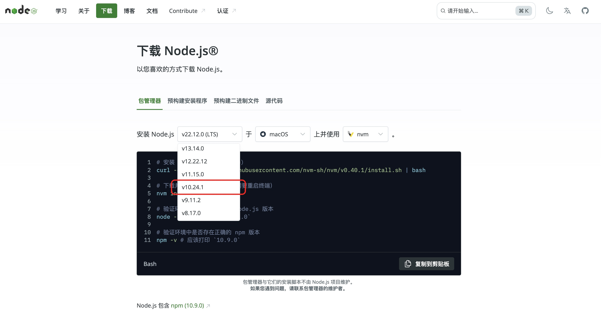
 nodeJS官网下载：https://nodejs.org/zh-cn/download/package-manager

 如果已经安装node，需要切换node版本，推荐使用```nvm ```或者``` n ```来切换，这样 ```node  ```与相关 ```NPM ```版本会保持适配；
 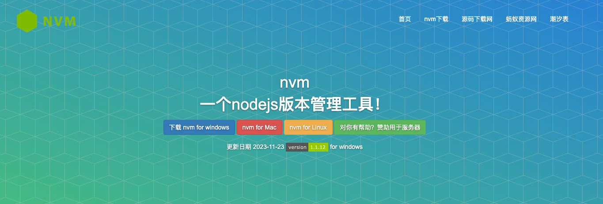

- nvm 切换 node 版本：[传送门](https://nvm.uihtm.com/)

- n 切换 node 版本:

```bash
    npm i -g n
        
    sudo n install 10.24.1（>10.20）

    sudo n ls（查看所有版本）
        
    sudo n version（切换）
```
> 💡💡💡 <span style="color:red; font-weight:600;">知识点</span>
<br>
 **npm（Node Package Manager）**
 <br>
 ```JavaScript``` 的包管理工具，用于安装、管理和分享代码包。它可以帮助开发者轻松地获取和使用各种开源库，这些库可以是用于构建用户界面的前端框架（如 ```React、Vue```），也可以是用于服务器端开发的后端框架（如 ```Express```），或者是各种工具库（如 ```Lodash```）等。

### 2、申请github  项目权限；
1.  申请一个 ```gitlab ```的账号，点击链接，让我们先来申请一个吧。
     👉  [申请地址](https://service.ushareit.me/#/declarationForm/T\_edit/8/sviId/66/service/551)
        
2.  申请gitlab账号之后我们就可以开始准备开通开发者权限了，此处加权限的方式有两种。
    
    1.  找到项目的相关负责人去加项目权限，一般是找自己的```Mentor ```。
        
    2.  走流程，直接申请 ```web ```组的开发者权限，申请链接的地址在钉钉-工作台-服务中心-快捷服务中，填写的时候直接说明开通web组的开发权限，直接就有```web ```这个组下面的所有仓库的开发者权限。
        
3.  gitlab地址：[http://gitlab.payermax.inner/](http://gitlab.payermax.inner/)
### 3、拉取代码；
 EP：拉取风控代码
  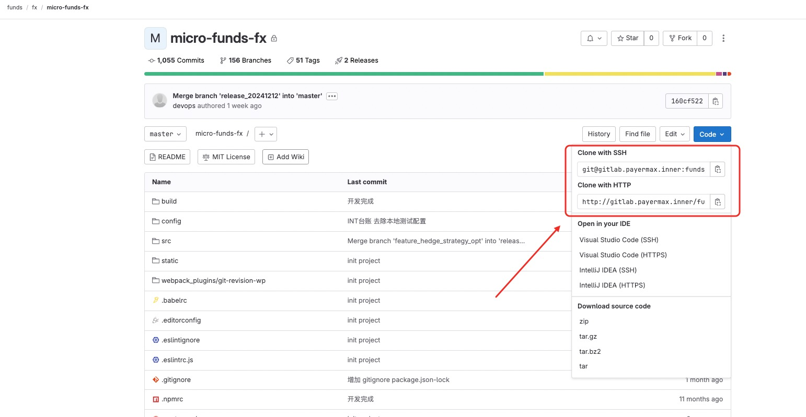

### 4、npm login 登录npm私有源；
1.  开通npm的私有源的权限可以联系基础架构组的同学，然后在宜搭上[申请工单](https://alag64.aliwork.com/APP_PS6QLUSO6HIBBK2QR21S/workbench/FORM-AA67094EA1C84445B958401DD559C69CQWUI)进行私有源权限的申请，然后在自己的电脑终端 **npm login**，然后记得账号密码跟你在钉钉的登陆的账号密码一样。

2.  [http://gitlab.payermax.inner/-/profile/keys](http://gitlab.payermax.inner/-/profile/keys)

申请走完后，项目登录
  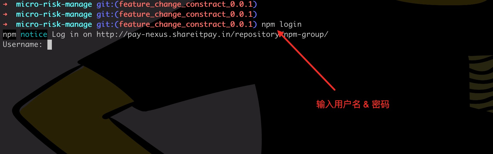
输入shareid 与 密码 登录私服库；

### 5、npm install;

  登录私服库以后，就可以安装 payermax的相关依赖了

```bash
  npm install
```

### 6、检查是否有遗漏的模块 npm install;

如果npm install 后还有遗漏的模块要安装。需要在 ```package.json ```中进行安装；

### 7、npm run dll 打包依赖；

项目通过webpack配置了热启动，所以需要先运行打包依赖；

```bash
 npm run dll
```

相当于执行 ```package.json``` 中的 ```scripts ```项 的 ```dll``` 配置

```js
  "scripts": {
    "dll": "node build/buildDll.js",
  },
```

> 💡💡💡 <span style="color:red; font-weight:600;">知识点</span>
<br>
 **npm scripts**
 <br>
 npm scripts是在```package.json```文件中定义的一系列脚本命令。这些脚本可以用于执行各种与项目相关的任务，如启动开发服务器、构建项目、运行测试等。例如，```"start": "node index.js"```就是一个简单的```npm ```脚本，当在命令行中执行```npm start```时，就会运行```node index.js```这个命令来启动项目。


 > 💡💡💡 <span style="color:red; font-weight:600;">知识点</span>
<br>
 **npm run dll**
 <br>
 当执行```npm run dll```时，通常是在调用一个自定义的脚本命令，这个命令的目的是构建一个```dll```文件。具体来说，它可能会将项目中的部分依赖（如 ```React、Redux 等大型库```）打包到一个单独的```dll```文件中。这样做的好处是，在后续的项目开发构建过程中（如使用```webpack```构建），如果这些依赖没有变化，就可以直接引用已经打包好的```dll```文件，而不需要重新打包这些依赖，从而大大加快构建速度。例如，在一个大型的 Web 应用开发中，每次构建都需要打包所有的依赖，这会花费很长时间。通过使用dll技术，将像```lodash、axios```等不太经常改变的库打包成```dll```文件后，只有当这些库本身更新或者项目的业务代码发生变化时，才需要重新构建相关部分，否则可以直接使用已有的```dll```文件，有效提高了开发效率。

### 8、npm run dev; 
依赖安装完成以后
```bash
  npm run dev
```
启动本地项目

相当于执行 ```package.json``` 中的 ```scripts ```项 的 ```dev``` 配置

```js
  "scripts": {
    "dev": "cross-env BABEL_ENV=development webpack-dev-server --inline --progress --config build/webpack.dev.conf.js",
  },
```

## 二、项目开发说明

### 1、服务代理
  目前支持两个服务 ```/omc-gateway```  与 ``` /pay-gate ``` 代理到本地；
  如需新增服务配置，在 ``` src -> config -> index.js ```中配置；

```js
    dev: {
        assetsSubDirectory: 'static',
        assetsPublicPath: '/',
        proxyTable: {
        "/omc-gateway": {
            target: host.getTarget('GATEWAY_COMMON', 'dev'),
            secure: true,
            changeOrigin: true,
            pathRewrite: {
            "^/omc-gateway": ""
            },
            logLevel: 'debug'
        },
        "/pay-gate": {
            target: host.getTarget('PAY_GATEWAY', 'dev'),
            secure: true,
            changeOrigin: true,
            pathRewrite: {
            "^/pay-gate": ""
            },
            logLevel: 'debug'
        }
        },
    }
```

### 2、无法登录成功

  如果遇到登录死循环，配置```src -> init.js ```临时开发

```js
// 1、获取 cookie
import { setCookie } from './utils/cookies';

export default function init(masterStore) {
  // 2、 写死cookie
  setCookie('c3d5b352-7f4a-40c8-bb6b-a0e46f158348');
  NProgress.start();
  return new Promise((resolve, reject) => {
    if (masterStore) {
      ...xxxx
    }
  });
}
```
 👉 [UPMS访问](https://upms-dev-new.payermax.com/#/systemManagementModule/userManagement)

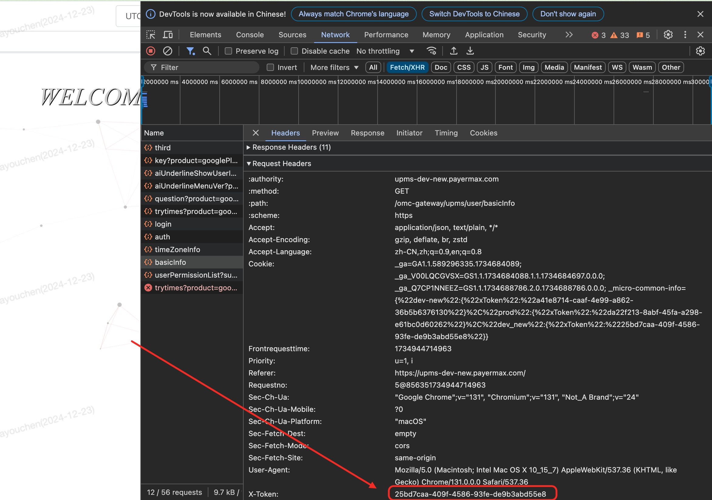

> 
setCookie中的值可以通过登录```UPS ```，从接口的 ```x-token ```获取。如无 ```UPMS ```账号，找测试同学申请；
```cookies```有过期时间，如果时间久了，需要重新进行获取；


 ## 三、编辑器配置

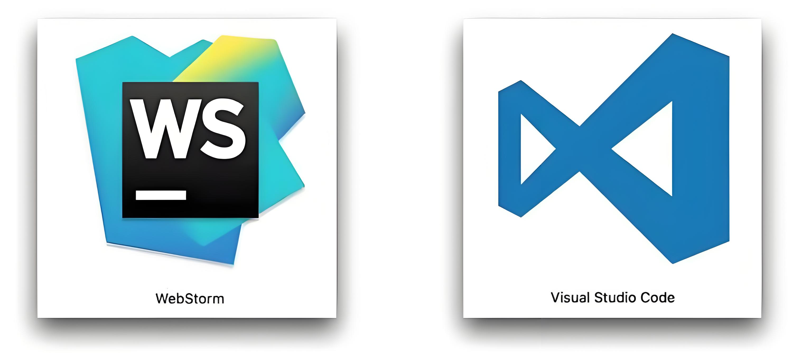

#### VScode 编辑器推荐配置

- **Vue - Official**

语法高亮和代码格式化，代码片段和自动补全

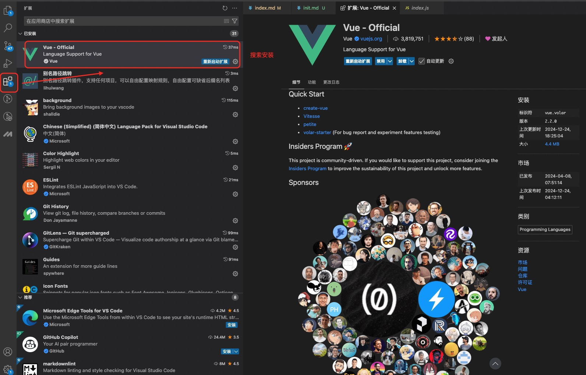

- **HTML/CSS**

HTML/CSS语法支持，前端党必备。
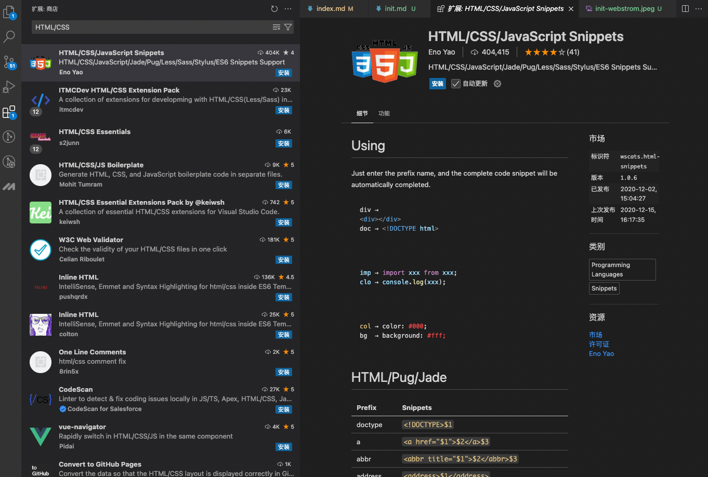

- **Auto Close Tag**

前端神器，只需要编写左标签，例如```<a>,<body>,<html>```等，会自动替我们完成右侧标签的填充如：```</a>, </body>, </html>```等。
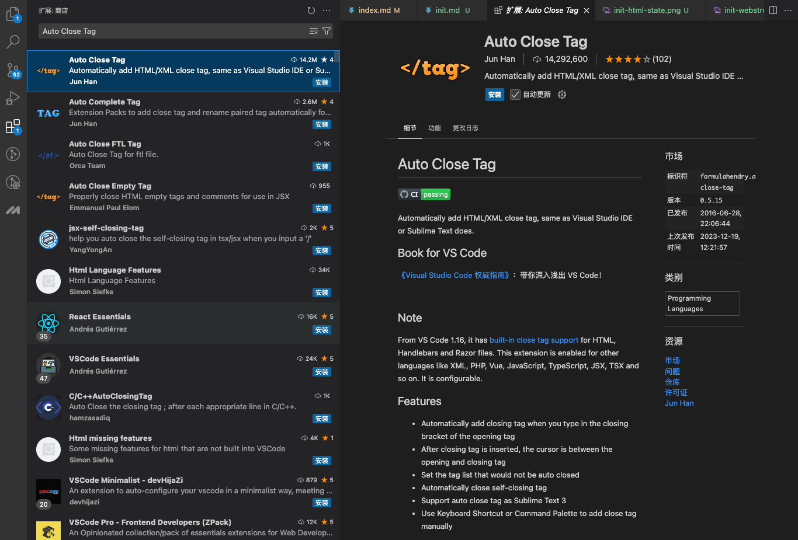

- **Auto Rename Tag**

前端神器，自动修改标签名，当我们修改一个标签时，自动修改对应的右侧标签。

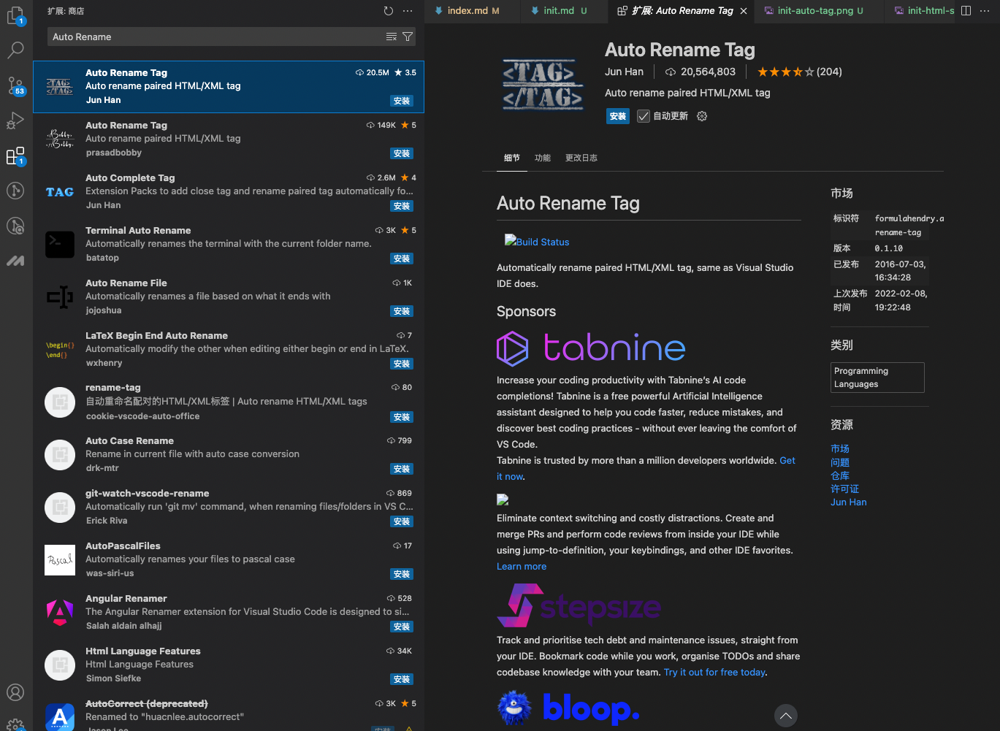


- **Live Server‌**

提供一个本地开发服务器，支持实时预览和调试网页应用程序，具有热重载功能‌；
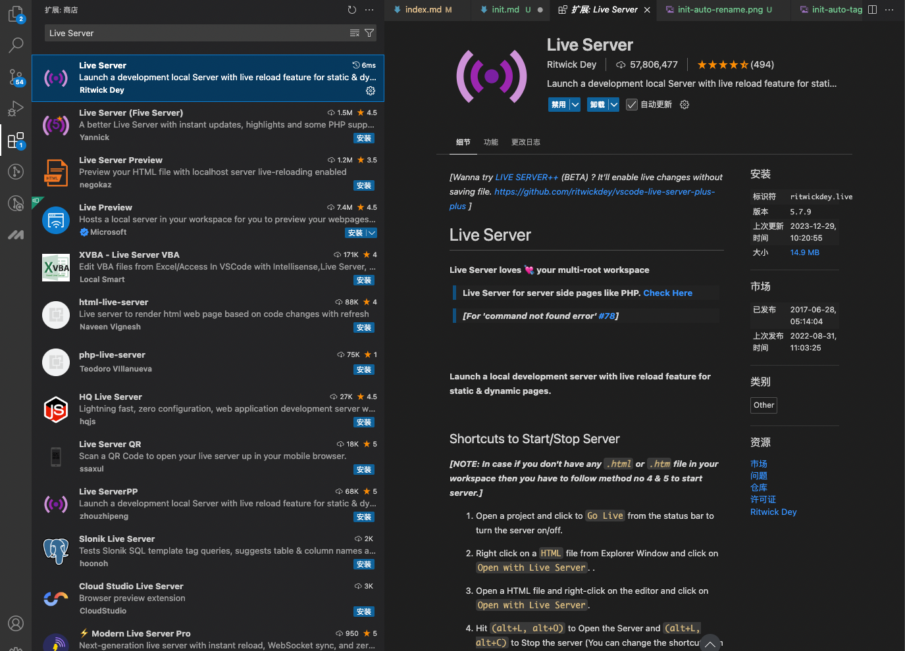

#### Webstrom编辑器推荐

WebStorm提供了强大的代码编辑功能，包括代码自动补全、语法高亮、代码折叠、代码格式化等，帮助开发人员编写高效、规范的代码。
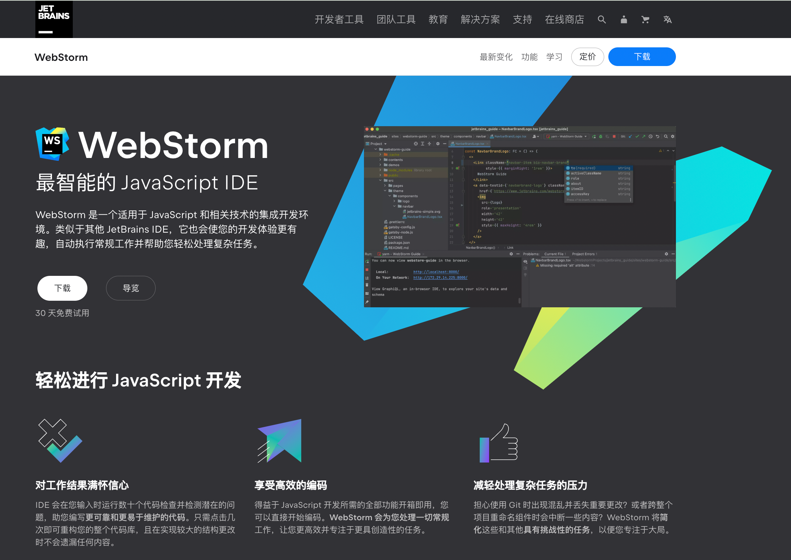


