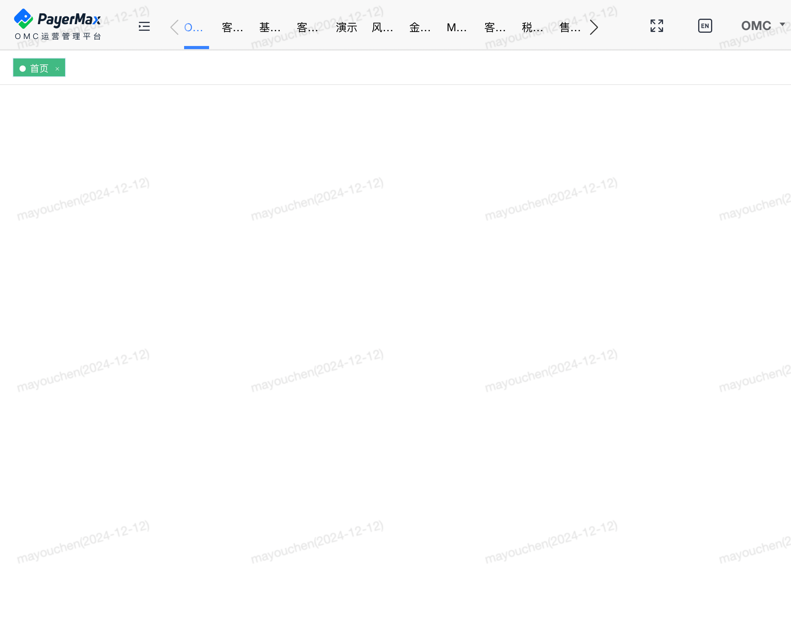
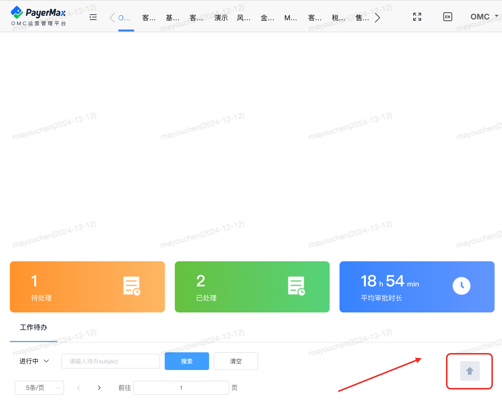

### BackToTop-回到顶部

#### 说明
    作用：点击回到页面顶部，适用于内容分过长的页面。
#### 基础用法

```html{2}
<!-- 组件使用 -->
 <BackToTop  />
```

```vue{2,7}
// 引入组件
import BackToTop from '@/components/BackToTop/index.vue';

export default {
  // 组件注册
  components: {
    BackToTop
  },
}
```

#### 参数说明
| 参数名            | 类型      | 是否必填  | 默认值 | 说明 | 
| ---- | ---- | ---- |  ---- | ---- |
| visibilityHeight | number   | 否       | 400 | 设置展示高度 | 
| backPosition            | number   | 否       | 0 | 展示的位置 | 
| customStyle            | 函数      | 否       | 自定义样式 | 配置外部样式 | 
| transitionName            | string   | 否       | fade | 配置动画效果 | 
#### 效果展示
没有超过一屏幕：不展示

超过一屏幕：展示



