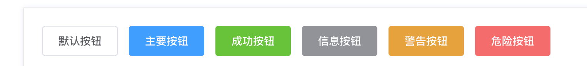

### BaseButton-基础按钮

#### 说明
   作用：基础的点击按钮
#### 基础用法

```html{2}
<!-- 组件使用，内容写在两个标签中间即可 -->
<BaseButton>这是按钮</BaseButton>
```

```vue{2,7}
// 引入组件
import BaseButton from '@/components/BaseButton/index.vue';

export default {
  // 组件注册
  components: {
    BaseButton
  },
}
```

#### 参数说明
| 参数名            | 类型      | 是否必填  | 默认值 | 说明 | 
| ---- | ---- | ---- |  ---- | ---- |
| type | string   | 否       | default | 可以传值primary、success、info、warning、danger | 

#### 效果展示


```vue{2,7}
<BaseButton>默认按钮</BaseButton>
<BaseButton type="primary">主要按钮</BaseButton>
<BaseButton type="success">成功按钮</BaseButton>
<BaseButton type="info">信息按钮</BaseButton>
<BaseButton type="warning">警告按钮</BaseButton>
<BaseButton type="danger">危险按钮</BaseButton>
```


