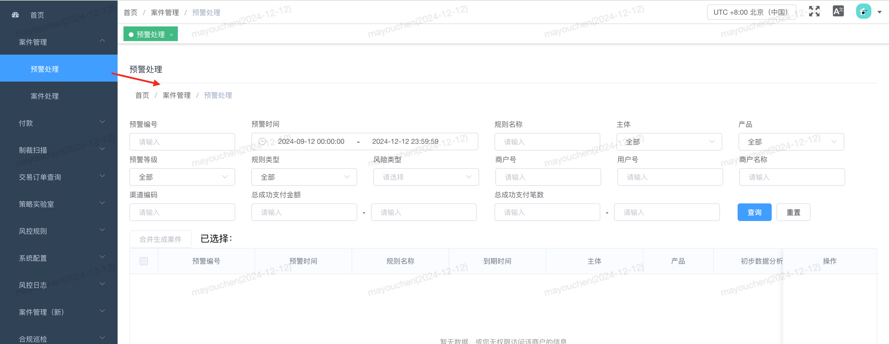

### Breadcrumb-面包屑

#### 说明
   作用：面包屑展示，主要用于网页导航，快速切换
#### 基础用法

```html{2}
<!-- 组件使用 -->
<Breadcrumb />
```

```vue{2,7}
// 引入组件
import Breadcrumb from '@/components/Breadcrumb/index.vue';

export default {
  // 组件注册
  components: {
    Breadcrumb
  },
}
```

#### 参数说明
  无任何参数，直接使用组件即可

#### 效果展示
在首页中使用

在子菜单中使用 ( 获取当前路由地址，变成面包屑导航地址)



