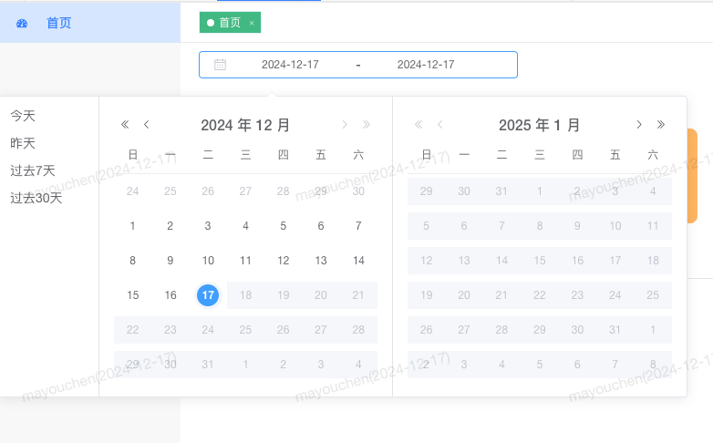

### Date-日期选择

#### 说明
  作用：日期选择框展示，选择日期
#### 基础用法

```html{2}
<!-- 组件使用 -->
 <omc-date-range-picker />
```

```vue{2,7}
// 引入组件
  不需要引入组件
```

#### 参数说明
| 参数名            | 类型      | 是否必填  | 默认值 | 说明 | 
| ---- | ---- | ---- |  ---- | ---- |
| startTime | string   | 否       | 无 | 开始时间，毫米级别 | 
| endTime | string   | 否       | 无 | 结束时间，毫米级别 | 
| options | Object  | 否       | 无 | 具体细节配置 | 

#### 效果展示
默认日期展示


选择日期展示



