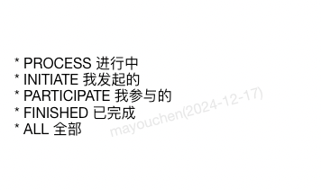
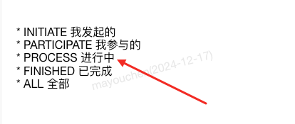

### Draggable-拖拽组件

#### 说明
  作用：拖拽组件，可以拖动( 里面必须是一个数组)
#### 基础用法

```html{2 5 7}
<!-- 组件使用 -->
<vue-draggable v-model="options">
  <div v-for="(item, index) in options" :key="index">
    * {{item.value}} {{item.label}}
  </div>
</vue-draggable>
```

```js{2,7}
// 引入组件 1、不需要引入 2、但是要定义数据
export default {
  data() {
      options: [
        { value: 'PROCESS', label: '进行中' },
        { value: 'INITIATE', label: '我发起的' },
        { value: 'PARTICIPATE', label: '我参与的' },
        { value: 'FINISHED', label: '已完成' },
        { value: 'ALL', label: '全部' }
      ],
  }
}
```

#### 参数说明
  无任何参数

#### 效果展示

拖拽前的效果


拖动列表数据（举例：把进行中 拖到第三行）直接使用鼠标拖动即可



