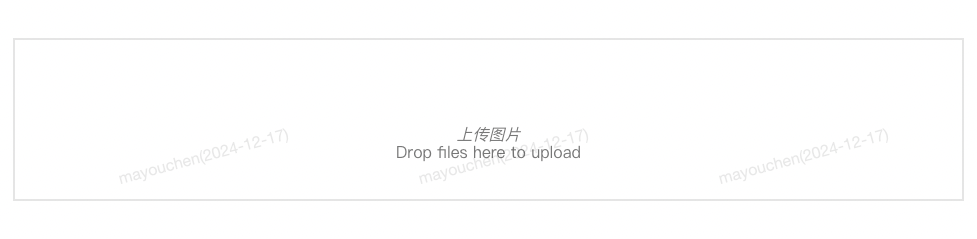
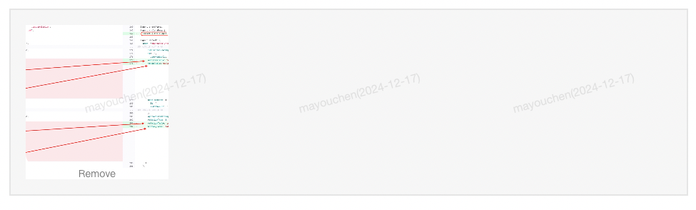
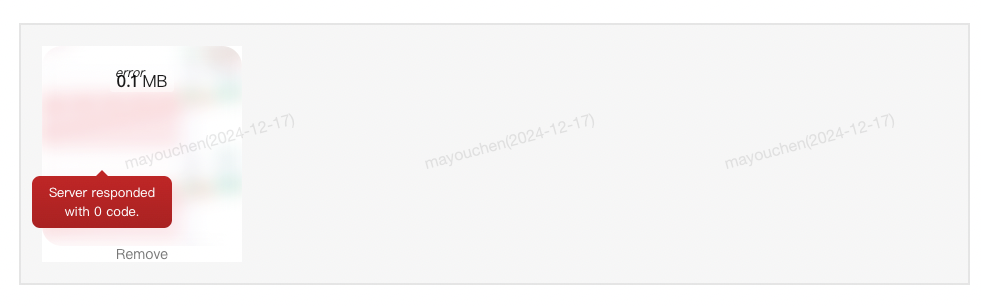

### Dropzone-拖拽上传图片组件

#### 说明
  作用：拖拽图片上传
#### 基础用法

```html{2 5 7}
<!-- 组件使用 -->
 <Dropzone :id="id" :url="url" />
```

```js{2,7}
// 引入组件 1、不需要引入 
export default {
  data() {
      id:"组件id",
      url:"上传地址"
  }
}
```

#### 参数说明

| 参数名            | 类型      | 是否必填  | 默认值 | 说明 | 
| ---- | ---- | ---- |  ---- | ---- |
| id | string   | 是       | 无 | 组件id (唯一值) | 
| url | string   | 是       | 无 | 上传的服务器地址 | 
| clickable | boolean  | 否       | true | 是否可以点击; | 
| defaultMsg | string   | 否       | 上传图片 | 默认文案| 
| acceptedFiles | string   | 否       | 无 | 接受文件类型 | 
| thumbnailHeight | Object  | 否       | 200 | 组件高度 | 
| thumbnailWidth | string   | 否       | 200 | 组件快读 | 
| showRemoveLink | boolean   | 否       | true | 是否展示删除链接 | 
| maxFilesize | Object  | 否       | 2 | 文件最大体积(M) | 
| maxFiles | string   | 否       | 3 | 文件最大数量 | 
| autoProcessQueue | boolean   | 否       | true | 自动进程队列排队  | 
| useCustomDropzoneOptions | Object  | 否       | true | 使用自定义下拉区选项 | 
| defaultImg | boolean   | 否       | false | 默认图片| 
| couldPaste | boolean   | 否       | false | 是否可以粘贴 | 

#### 效果展示

默认效果

拖拽后效果


鼠标hover效果



