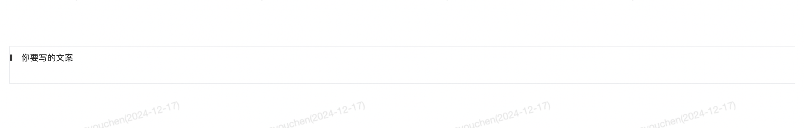

### FeatureContent-容器内容

#### 说明
 作用：在一个盒子里面展示一些内容；
#### 基础用法

```html{2}
<!-- 组件使用 -->
  <omc-feature-content title="你要写的文案"/>
```

```js{2,7}
// 引入组件
不需要引入
```

#### 参数说明
| 参数名            | 类型      | 是否必填  | 默认值 | 说明 | 
| ---- | ---- | ---- |  ---- | ---- |
| title | string   | 否       | 无 | 展示的内容 | 
| fitPadding | boolean   | 否       | true | 是否在容器里展示 | 
| hasTitle | boolean  | 否       | true | 是否需要展示内容 | 

#### 效果展示




