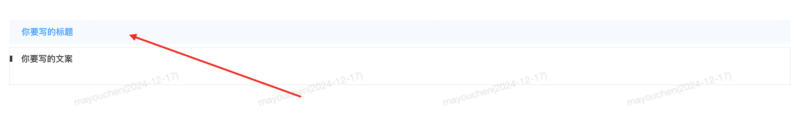
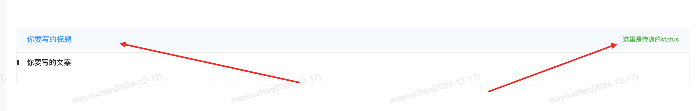
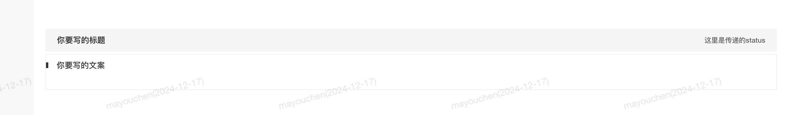

### FeatureTitle-容器标题

#### 说明
 作用：在一个盒子展示一个标题；
#### 基础用法

```html{2}
<!-- 组件使用 -->
<omc-feature-title status="这里是传递的status" > 你要写的标题</omc-feature-title>
```

```js{2,7}
// 引入组件
不需要引入
```

#### 参数说明
| 参数名            | 类型      | 是否必填  | 默认值 | 说明 | 
| ---- | ---- | ---- |  ---- | ---- |
| status | string   | 否       | 无 | 标题状态 | 
| isActive | boolean   | 否       | true | 是否在容器里展示 | 

#### 效果展示
1、默认状态；

```html{2}
<!-- 组件使用 -->
<omc-feature-title> 你要写的标题</omc-feature-title>
```


2、配置status；

```html{2}
<!-- 组件使用 -->
<omc-feature-title status="这里是传递的status"> 你要写的标题</omc-feature-title>
```



3、配置isActive="false"；

```html{2}
<!-- 组件使用 -->
<omc-feature-title status="这里是传递的status" :isActive="false"> 你要写的标题</omc-feature-title>
```




