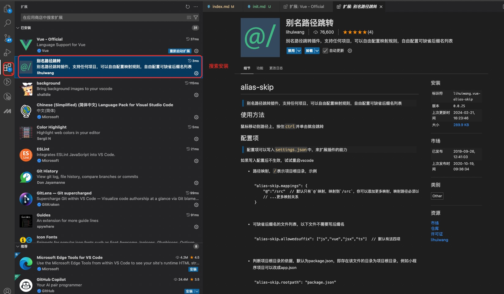
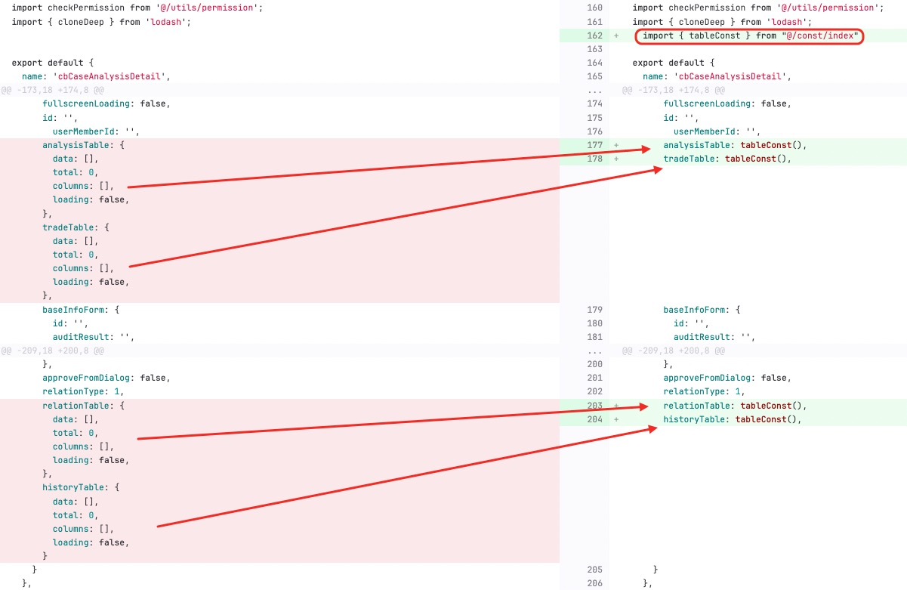
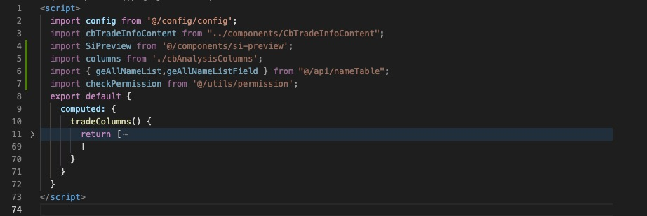

### 一、v-for未使用key或使用错误
<br/>

> 💡💡💡 <span style="color:red; font-weight:600;">知识点</span>
<br>

- [什么是key？](https://v2.cn.vuejs.org/v2/guide/conditional.html#%E7%94%A8-key-%E7%AE%A1%E7%90%86%E5%8F%AF%E5%A4%8D%E7%94%A8%E7%9A%84%E5%85%83%E7%B4%A0)
- [key的作用？](https://v2.cn.vuejs.org/v2/api/#key)


---

##### （ 1 ）解释说明
> 🧑‍⚕️ ```不加key的后果 ```

- **DOM 更新效率问题**
 <br>
   如果没有提供```key```属性，Vue 会使用一种 “就地复用” 策略。这意味着当列表数据发生变化（例如数组元素的添加、删除或重新排序）时，```Vue``` 会尽可能地复用已存在的 ```DOM ```元素，而不是重新创建和替换所有元素。

- **组件状态问题（针对组件列表）**
 <br>
   如果没有```key ```，当数组顺序改变时，```Vue``` 可能会错误地复用组件，导致组件的状态与对应的用户数据不匹配。比如，原本选中的是第一个用户组件，当数据重新排序后，可能会错误地将选中状态应用到其他用户组件上。


> ✅ ```加key的好处```

- **精确的 DOM 更新**
 <br>
  当提供了key属性后，```Vue``` 会根据```key```的值来跟踪每个节点的身份。这使得 ```Vue``` 能够更精确地确定哪些 ```DOM```元素需要更新、添加或删除。

- **正确的组件状态管理（针对组件列表）**
 <br>
  当数据重新排序或者元素更新时，```Vue``` 会根据```key```正确地匹配组件和数据。这样可以保证每个组件的内部状态（如选中状态、表单输入值等）与对应的用户数据保持一致，避免状态混乱的问题。

----

##### （ 2 ）案例分析

👉 <span style="color:red; font-weight:600;">错误写法 1</span>

完全没有配置```key```

```html
 <template v-for="item in list">
    <el-descriptions-item :label="item.label">
    {{  getTradeInfo(item.prop)}}
    </el-descriptions-item>
 </template>
```

👉 <span style="color:red; font-weight:600;">错误写法 2</span>

设置```index```，但没有配置```key```

```html
 <template v-for="(item,index) in list">
      <el-descriptions-item  :label="item.label" :span="1">
        {{getBaseInfo(item)}}
      </el-descriptions-item>
    </template>

```

👉 <span style="color:red; font-weight:600;">错误写法 3</span>

```template```上直接写```key```

```html
<template v-for="(it,subIndex) in item.nameTableFieldList" :key="subIndex">
        <el-date-picker
            v-else-if="it.fieldType === 'bigint'"
            class="mediumFormItem"
            v-model="item.tableFieldParams[it.fieldName]"
            type="datetime"
        />
        <el-select v-model="item.tableFieldParams[it.fieldName]"
                    v-else-if="it.fieldType === 'char'"
                    style="width: 220px;">
            <el-option
            v-for="(option, opIndex) in list"
            :key="opIndex"
            :label="option.label"
            :value="option.value"
            />
        </el-select>
        </el-form-item>
</template>
```

----

这里推荐两种写法解决问题，如下：

👉 <span style="color:blue; font-weight:600;">正确写法 1</span>

将key加在遍历的子项上

```html
 <template v-for="(item,index) in list">
    <el-descriptions-item  :key="index" :label="item.label">
      {{  getTradeInfo(item.prop)}}
    </el-descriptions-item>
  </template>

```
👉 <span style="color:blue; font-weight:600;">正确写法 2</span>

在子项上进行循环

```html
  <template>
    <el-descriptions-item v-for="(item,index) in list" :key="index" :label="item.label">
      {{  getTradeInfo(item.prop)}}
    </el-descriptions-item>
  </template>

```

这里“强烈推荐”使用，```vscode ```插件 ```vue-official``` 插件，会代码高亮，并提示简单语法修改
  


<br><br>
<div style="display:flex; justify-content: center;height: 3px;background-image: linear-gradient(to right, #3498db, #e74c3c);
border-radius: 1px;">
  <div style="margin-top:-10px;">🔴🟠🟡🟢🔵🟣🟤⚫⚪</div>
</div>
<br><br>

### 二、引入文件路径过长
<br/>

##### （ 1 ）解释说明

> 🧑‍⚕️ ```引入文件路径过长```

- **可读性差**
   <br>
   当 Vue 项目中的文件路径很长时，代码的可读性会受到严重影响。例如，在一个组件中引入一个样式文件，路径可能是```../../../styles/components/button/button.css```。这种冗长的路径使得开发者很难快速理解文件之间的关系，尤其是在大型项目中，复杂的路径层次结构会让人眼花缭乱。

- **维护成本高**
  <br>
   如果项目的目录结构发生变化，例如对文件和文件夹进行了重新组织，那么长路径的文件引用很可能需要逐个修改。

- **容易出现拼写错误**
  <br>
   较长的文件路径增加了拼写错误的风险。在输入路径时，很容易出现诸如字母拼写错误、大小写错误或者斜杠方向错误（在 ```Windows``` 和 ```Linux``` 系统中斜杠方向有所不同）等问题。


> ✅ ```使用简化的快捷路径好处```

- **提高可读性**
    <br>
      1、通过设置快捷路径（例如使用 ```Webpack``` 的别名或者 ```Vue CLI``` 的路径别名功能），可以将复杂冗长的路径简化为更易读的形式。比如，将 ```../../../styles/components/button/button.css``` 简化为 ```@styles/button.css``` ，这样开发者可以更直观地了解文件的类型（这里是样式文件）和大致用途。
    <br>
      2、对于组件之间的引用也是如此，使用简化路径可以让代码的结构更加清晰，方便开发者快速理解各个组件之间的关系。

- **降低维护成本**
   <br>
  当项目结构发生变化时，使用快捷路径只需要修改别名的配置，而不需要逐个修改文件引用的路径。

- **减少拼写错误风险**

---

##### （ 2 ）案例分析

原始引入文件

```js
<script>
  import cardColumns from '../../../../../cardColumns';
  import userColumns from '../../../../../src/view/client/userColumns';
  import deviceColumns from '../../../../.deviceColumns';
  import merchantColumns from './merchantColumns';
  import alertPanelColumns from './alertPanelColumns';

   export default {
    name: "test-component",
    data() {
      return {
        loading: false,
        queryForm: {
          pageNum: 1,
          pageSize: 10,
        },
        queryFormList: [],
        tableData: [],
        total: 0,
        columns: [],
        loading: false,
      };
    },
    computed: {},
    watch: {},
    methods: {},
    mounted() {},
  };
</script>

```

👉 解决方案：采用快捷路径引入文件，配置```webpack```, 修改```src -> build -> webpack.base.conf.js```内容；

```js
module.exports = {
  context: path.resolve(__dirname, '../'),
  entry: {
    app: './src/main.js'
  },
  resolve: {
    extensions: ['.js', '.vue', '.json'],
    alias: {
      '@': resolve('src'),
      'api': resolve('src/api'),
      'assets': resolve('src/assets'),
      'components': resolve('src/components'),
      'config': resolve('src/config'),
      'const': resolve('src/const'),
      'directive': resolve('src/directive'),
      'filters': resolve('src/filters'),
      'icons': resolve('src/icons'),
      'lang': resolve('src/lang'),
      'mock': resolve('src/mock'),
      'router': resolve('src/router'),
      'store': resolve('src/store'),
      'styles': resolve('src/styles'),
      'utils': resolve('src/utils'),
      'views': resolve('src/views')
    }
  },
}
```
目前支持引入src文件下的所有文件

```plaintext
src/
├── api/                ---------- 请求接口
├── assets/             ---------- 资源
├── components/         ---------- 公共组件
├── config/             ---------- 配置文件（站点配置/灰度key配置/常量配置等）
├── directive/          ---------- 自定义指令
├── const/              ---------- 通用变量
├── layout/             ---------- 布局
├── filters/            ---------- 过滤方法
├── lang                ---------- 语言包
├── mock                ---------- mock数据
├── icons               ---------- 图标
├── store/              ---------- 状态管理
├── router/             ---------- 路由配置
├── utils/              ---------- 工具类
├── store/              ---------- 前端数据管理
├── App.vue             ---------- 根组件
├── main.js             ---------- 应用入口脚本
```


案例：在一个VUE页面引入src下的文件

```vue
<template>
  <div>测试文件引入</div>
</template>

<script>
import { getPageList } from "@/api/nameApproval";
import { uploadApi } from 'api/common';
import SiPreview from 'components/si-preview';
import { tableConst } from "const/index";
 import { getName } from 'utils/user';

export default {
  name: "MyComponent",
  components: {},
  props: {},
  data() {
    return {};
  },
  computed: {},
  watch: {},
  methods: {},
  mounted() {},
};
</script>

<style scoped lang="scss">

</style>
```

这里的对应规则如下：

```plaintext
      '@'          ===    src
      'api'        ===    src/api
      'assets'     ===    src/assets
      'components' ===    src/components
      'config'     ===    src/config
      'const'      ===    src/const
      'directive'  ===    src/directive
      'filters'    ===    src/filters
      'icons'      ===    src/icons
      'lang'       ===    src/lang
      'mock'       ===    src/mock
      'router'     ===    src/router
      'store'      ===    src/store
      'styles'     ===    src/styles
      'utils'      ===    src/utils
      'views'      ===    src/views
```
推荐使用vscode 插件``` path```智能匹配路径，开发效果更佳

 


<br><br>
<div style="display:flex; justify-content: center;height: 3px;background-image: linear-gradient(to right, #3498db, #e74c3c);
border-radius: 1px;">
  <div style="margin-top:-10px;">🔴🟠🟡🟢🔵🟣🟤⚫⚪</div>
</div>
<br><br>

### 三、通用数据大量冗余
<br/>

> 💡💡💡 <span style="color:red; font-weight:600;">知识点</span>
<br>

- [什么是浅拷贝？](https://developer.mozilla.org/zh-CN/docs/Glossary/Shallow_copy)
- [什么是深拷贝？](https://developer.mozilla.org/zh-CN/docs/Glossary/Deep_copy)


---

##### （ 1 ）解释说明

> 🧑‍⚕️ ```通用数据大量冗余后果```

- **可读性差**
   <br>
   在项目中代码的可读性会受到严重影响。多处的引用使用会让人眼花缭乱。

- **维护成本高**
  <br>
   如果项目的数据结构（接口）发生变化，那么使用的初始化数据需要逐个修改。

- **内存占用问题**
  <br>
   每个重复定义的变量都会占用一定的内存空间，即便它们的值相同。在 ```Vue``` 项目规模较大、组件众多且存在大量重复变量定义的情况下，会造成不必要的内存开销，可能影响整个应用的性能，尤其在一些内存资源相对紧张的运行环境中，这种影响可能会更加明显。


> ✅ ```通用数据优化处理的好处```

- **提高可读性**
    这样开发者可以更直观地了解变量和大致用途。

- **降低维护成本**
   <br>
   当项目数据发生变化时，开发者只需要维护常量文件即可。

- **内存占用问题得到缓解**


---

##### （ 2 ）案例分析

 通用的数据维护在 ```src -> const -> index.js```文件中

 如果自己项目没有可以创建，并复制内容；

 ```index.js ```的内容如下：

```js
export const validatorRuleSetNum = (rule, value, callback) => {
  const reg = /^[A-Za-z][A-Za-z0-9_]*$/;
  if (reg.test(value)) {
    callback();
  } else {
    return callback(new Error('111'));
  }
};

export const validatorCustomTime = (rule, value, callback) => {
  if (this.nameTableFieldForm.timeType === 'customTime' && (value === 'effectiveTime' || value === 'expiredTime')) {
    callback(new Error('111'));
  } else {
    callback();
  }
};

export const runAllFunctions = async(val) => {
  try {
    await Promise.all([...val]);
  } catch (error) {
    console.error(error);
  }
};

export const ruleSetForm = () => {
  return {
    ruleSetNum: '',
    ruleSetName: '',
    ruleSetDesc: '',
    ruleSetCategory: null,
    ruleList: [{
      ruleId: '',
      isShortCircuit: 0,
      priority: 100,
    }],
  };
};

export const queryFormConst = () => {
  return {
    ruleSetName: '',
    createBy: '',
    ruleSetStatus: '',
    ruleSetCategory: null,
    domainCode: '',
  };
};

export const tableConst = () => {
  return {
    data: [],
    total: 0,
    columns: [],
    loading: false,
  };
};

export const FileldTableFieldForm = () => {
  return {
    fieldName: '',
    fieldType: 'varchar',
    fieldDesc: '',
    fieldDescEn: '',
    decimalLength: null
  };
};

export const DialogFormInfo = () => {
  return {
    timezoneIndex: '',
    globalTimeZone: '',
    zoneName: '',
  };
};
```
在页面中查找，发现有相同的变量，可以直接替换。

👉  举例：定义了很多table，里面的每个参数的值都是

```js
    export default {
        name: "cbCaseAnalysis",
        data() {
            return {
                tableMain: {
                    data: [],
                    total: 0,
                    columns: [],
                    loading: false,
                },
                tableChild: {
                    data: [],
                    total: 0,
                    columns: [],
                    loading: false,
                },
                tableConsult: {
                    data: [],
                    total: 0,
                    columns: [],
                    loading: false,
                },
            };
        }
    }
```

这时候我们就可以替换，这里重复的代码，使用```index.js ```中的```tableConst ```函数。

```js
    import { tableConst } from "@/const/index";
    export default {
        name: "cbCaseAnalysis",
        data() {
            return {
                tableMain: tableConst(),
                tableChild: tableConst(),
                tableConsult: tableConst(),
            };
        },
    }
```



<br><br>
<div style="display:flex; justify-content: center;height: 3px;background-image: linear-gradient(to right, #3498db, #e74c3c);
border-radius: 1px;">
  <div style="margin-top:-10px;">🔴🟠🟡🟢🔵🟣🟤⚫⚪</div>
</div>
<br><br>

### 四、style 标签未使用scoped

> 💡💡💡 <span style="color:red; font-weight:600;">知识点</span>
<br>

- [什么是scoped？](https://v2.cn.vuejs.org/v2/guide/comparison.html#%E7%BB%84%E4%BB%B6%E4%BD%9C%E7%94%A8%E5%9F%9F%E5%86%85%E7%9A%84-CSS)
- [lang="scss"是什么意思?](https://worktile.com/kb/p/3541684)
<br/>

---

##### （ 1 ）解释说明

> 🧑‍⚕️ ```style 标签未使用scoped坏处```

- **样式冲突**
   <br>
  在一个大型的``` Vue ```项目或者包含多个组件的应用中，如果```style ```标签没有使用```scoped ```，样式是全局生效的。这意味着一个组件中的样式规则可能会意外地影响到其他组件的样式。

- **维护困难**
  <br>
  当没有```scoped```限制时，随着项目规模的增大和组件数量的增加，很难追踪某个样式规则是在哪里定义的，以及它会影响哪些组件。这使得样式的维护变得复杂，尤其是在修改或调试样式时。

- **代码复用性降低**
  <br>
   由于全局样式可能会相互干扰，在复用组件时可能会出现样式不匹配的问题。如果一个组件在一个环境中能够正常显示，但是当它被复用到另一个页面或者与其他组件一起使用时，由于全局样式的影响，可能会出现样式错乱的情况。


> ✅ ```style 标签使用scoped好处```

- **样式隔离**
    使用```scoped```后，样式只会作用于当前组件内部的元素。```Vue``` 会自动为组件中的每个元素添加一个唯一的属性（如```data-v- [hash]```），并且在样式规则中通过属性选择器来限制样式的作用范围。

- **提高维护性**
   <br>
   当样式是局部作用于每个组件时，开发人员可以很容易地知道某个样式规则只与当前组件相关。这使得在修改和调试样式时，只需要关注当前组件的```style```标签内容即可，不需要担心会对其他组件的样式产生影响。

- **增强代码复用性**
   <br>
   由于每个组件的样式是隔离的，组件在不同的环境中复用变得更加容易。无论组件被复用到哪里，它的样式都能保持相对独立，不会受到其他组件或全局样式的干扰。


---

##### （ 2 ）案例分析

👉 <span style="color:red; font-weight:600;">错误写法 1</span>

```html
<style lang="scss">
  .el-dialog {
    width: 430px;
    .el-dialog__body {
      line-height: 1.5;
    }
    .red {
      padding: 0 1px;
      color: red;
    }
  }
</style>
```

👉 <span style="color:red; font-weight:600;">错误写法 2</span>

```scoped```配置错误

```html
<style lang="scoped">
  .el-dialog {
    width: 430px;
    .el-dialog__body {
      line-height: 1.5;
    }
    .red {
      padding: 0 1px;
      color: red;
    }
  }
</style>
```

👉 <span style="color:blue; font-weight:600;">正确写法</span>

没有配置 ```scoped,``` 打包后可能导致样式错乱

```html
<style lang="scss" scoped>
  .el-dialog {
    width: 430px;
    .el-dialog__body {
      line-height: 1.5;
    }
    .red {
      padding: 0 1px;
      color: red;
    }
  }
</style>
```

<br><br>
<div style="display:flex; justify-content: center;height: 3px;background-image: linear-gradient(to right, #3498db, #e74c3c);
border-radius: 1px;">
  <div style="margin-top:-10px;">🔴🟠🟡🟢🔵🟣🟤⚫⚪</div>
</div>
<br><br>

### 五、相似的样式重复copy
<br/>

##### （ 1 ）解释说明
> 🧑‍⚕️ ```相似的样式重复copy```

- **维护成本高**
   <br>
  当存在相似样式重复复制的情况时，如果需要对这些相似的样式进行修改，比如修改颜色、字体大小、间距等属性，就必须在每个复制了该样式的地方进行修改。这会耗费大量的时间和精力，而且很容易出现遗漏某些地方未修改的情况。

- **代码冗余**
  <br>
  大量复制相似的样式代码会使代码库变得臃肿。这不仅增加了代码文件的大小，还降低了代码的可读性和可维护性。对于新加入项目的开发人员来说，理解和梳理这些重复的样式代码会更加困难。

- **不一致性风险**
  <br>
   由于全局样式可能会相互干扰，在复用组件时可能会出现样式不匹配的问题。如果一个组件在一个环境中能够正常显示，但是当它被复用到另一个页面或者与其他组件一起使用时，由于全局样式的影响，可能会出现样式错乱的情况。


> ✅ ```相似的样式统一处理优点```

- **降低代码量**
   将相似的样式提取出来，放到一个公共的 CSS 文件中，简洁明了；

- **提高维护性**
   <br>
   这使得在修改和调试样式时，只需要关注公共的样式文件，不需要担心会对其他组件的样式产生影响。


---

##### （ 2 ）案例分析


👉 <span style="color:red; font-weight:600;">冗余写法</span>

index1.vue

```html
<script>
    export default {
        name: "cbCaseAnalysis",
        data() {
            return {};
        },
    }
</script>
<style lang="scss" scoped>
  .el-dialog {
    width: 430px;
    .el-dialog__body {
      line-height: 1.5;
    }
    .red {
      padding: 0 1px;
      color: red;
    }
  }
</style>
```

index2.vue

```html
<script>
    export default {
        name: "cbCaseAnalysis2",
        data() {
            return {};
        },
    }
</script>
<style lang="scss" scoped>
  .el-dialog {
    width: 430px;
    .el-dialog__body {
      line-height: 1.5;
    }
    .red {
      padding: 0 1px;
      color: red;
    }
  }
</style>
```

index3.vue

```html
<script>
    export default {
        name: "cbCaseAnalysis3",
        data() {
            return {};
        },
    }
</script>
<style lang="scss" scoped>
  .el-dialog {
    width: 430px;
    .el-dialog__body {
      line-height: 1.5;
    }
    .red {
      padding: 0 1px;
      color: red;
    }
  }
</style>
```

👉 <span style="color:blue; font-weight:600;">优化方案 1</span>

styles.scss

```css
.el-dialog {
    width: 430px;
    .el-dialog__body {
      line-height: 1.5;
    }
    .red {
      padding: 0 1px;
      color: red;
    }
  }
```

index.vue
```html
<script>
    export default {
        name: "cbCaseAnalysis3",
        data() {
            return {};
        },
    }
</script>
<style lang="scss" scoped>
  @import './styles.scss';
</style>
```

👉 <span style="color:blue; font-weight:600;">优化方案 2</span>

也可以在组件的```<script>```标签中使用```require ```来引入 ```scss``` 文件，不过这种方式相对复杂一些，并且不太符合常规的样式管理方式。例如
index.vue
```html
<script>
    require('./styles.scss');
    export default {
        name: "cbCaseAnalysis",
        data() {
            return {};
        },
    }
</script>
<style lang="scss" scoped>
</style>
```


<br><br>
<div style="display:flex; justify-content: center;height: 3px;background-image: linear-gradient(to right, #3498db, #e74c3c);
border-radius: 1px;">
  <div style="margin-top:-10px;">🔴🟠🟡🟢🔵🟣🟤⚫⚪</div>
</div>
<br><br>

### 六、setTimeout 与 setInterval 未清除
<br>

##### （ 1 ）解释说明
在 Vue2 项目中，```setTimeout```用于在一定延迟后执行一段代码。然而，如果不适当清除```setTimeout```，可能会导致一些问题。例如，当一个组件被销毁时，setTimeout中定义的函数可能仍然会执行，这可能会导致错误，特别是当该函数引用了已销毁组件中的数据或 ```DOM``` 元素时。

---

##### （ 1 ）案例分析

👉 <span style="color:red; font-weight:600;">错误写法</span>

```js
  pageChange() {
      if (!this.isPending) {
        this.isPending = true;
        setTimeout(() => {
          this.isPending = false;
          this.$emit('pageChange', this.pagination);
        }, 0);
      }
    }
```
```beforeDestroy```钩子在组件销毁之前被调用，这是清除```setTimeout```的理想时机。可以在组件中定义一个变量来存储```setTimeout```的返回值（一个定时器标识符），然后在```beforeDestroy```钩子中使用```clearTimeout```来清除定时器。

👉 <span style="color:blue; font-weight:600;">正确写法</span>

```js
 <script>
export default {
  data() {
    return {
      timer: null,
    };
  },
  mounted() {
    this.timer = setTimeout(() => {
       xxxx
    }, 1000);
  },
  beforeDestroy() {
    clearTimeout(this.timer);
  }
};
</script>
```

👉 <span style="color:blue; font-weight:600;">正确写法</span>

```js
 <script>
export default {
  data() {
    return {
      timer: null,
    };
  },
  mounted() {
    this.timer = setInterval(() => {
       xxxx
    }, 1000);
  },
  beforeDestroy() {
    clearTimeout(this.timer);
  }
};
</script>
```


<br><br>
<div style="display:flex; justify-content: center;height: 3px;background-image: linear-gradient(to right, #3498db, #e74c3c);
border-radius: 1px;">
  <div style="margin-top:-10px;">🔴🟠🟡🟢🔵🟣🟤⚫⚪</div>
</div>
<br><br>

### 七、addEventListener未清除
<br>

> 💡💡💡 <span style="color:red; font-weight:600;">知识点</span>
<br>

- [什么是addEventListener？](https://developer.mozilla.org/zh-CN/docs/Web/API/EventTarget/addEventListener)
<br/>

---

##### （ 1 ）解释说明
1. **内存泄漏问题**
   - 当使用`window.addEventListener`添加事件监听器后，如果没有正确清除它，最主要的问题是可能导致内存泄漏。在JavaScript中，事件监听器会占用内存空间，因为它们与相应的函数引用和事件目标（在这种情况下是`window`对象）相关联。
   - 例如，在一个Vue2组件中，如果在`mounted`生命周期钩子中添加了一个`window.addEventListener`来监听`scroll`事件，但在组件销毁（`beforeDestroy`生命周期钩子）时没有清除这个事件监听器，那么每次组件实例化和销毁后，这个事件监听器占用的内存都不会被释放。随着组件的不断创建和销毁，内存占用会不断增加，最终可能导致应用程序性能下降，甚至出现内存不足的情况。
2. **意外的行为和错误**
   - 即使没有内存泄漏问题，未清除的事件监听器也可能导致意外的行为。假设一个组件在加载时添加了一个`window`的`resize`事件监听器来调整某些元素的布局。当组件被销毁后，如果该事件监听器仍然存在，那么在窗口大小改变时，已经销毁的组件相关的代码可能会被意外触发。
   - 例如，被销毁组件中的函数可能会尝试访问不存在的DOM元素或者已经被销毁的组件数据，这会导致JavaScript错误，如`TypeError`（无法读取属性）或`ReferenceError`（未定义的引用）。这种错误可能会使应用程序的行为变得不可预测，影响用户体验。
3. **性能问题（除内存泄漏外）**
   - 过多未清除的`window.addEventListener`会增加事件处理的开销。每次事件触发时，所有与之相关的监听器都会被调用。如果有大量未清除的监听器，尤其是那些执行复杂操作的监听器，会导致事件处理过程变得缓慢，降低应用程序的响应速度。
   - 例如，在一个复杂的Web应用中，有许多组件在加载时添加了`window`的`mousemove`事件监听器来实现各种交互效果。如果这些监听器在组件卸载后没有被清除，当用户移动鼠标时，大量不必要的函数会被调用，占用CPU资源，导致页面的性能下降，如出现卡顿现象。
4. **难以调试**
   - 由于未清除的事件监听器，调试可能变得更加困难。如果在组件销毁后仍然有未清除的事件监听器，那么很难确定哪个监听器导致了问题。

---

##### （ 2 ）案例分析

👉 <span style="color:red; font-weight:600;">错误写法</span>
```js
  mounted() {
    this.initChart()
    this.__resizeHanlder = debounce(() => {
      if (this.chart) {
        this.chart.resize()
      }
    }, 100)
    window.addEventListener('resize', this.__resizeHanlder)
  }
```

👉 <span style="color:blue; font-weight:600;">正确写法</span>
```js
  mounted() {
    this.initChart()
    this.__resizeHanlder = debounce(() => {
      if (this.chart) {
        this.chart.resize()
      }
    }, 100)
    window.addEventListener('resize', this.__resizeHanlder)
  },
  beforeDestroy() {
    window.removeEventListener('resize', this.__resizeHanlder)
  },
  ```

<br>


<br><br>
<div style="display:flex; justify-content: center;height: 3px;background-image: linear-gradient(to right, #3498db, #e74c3c);
border-radius: 1px;">
  <div style="margin-top:-10px;">🔴🟠🟡🟢🔵🟣🟤⚫⚪</div>
</div>
<br><br>

### 八、项目中引用了大量未使用的模块
<br>

##### （ 1 ）解释说明
1. **代码冗余**
   - 未使用的模块引入会增加代码的冗余。如果项目中存在大量未使用的模块，那么这些模块的代码会被引入到项目中，增加了代码的体积和加载时间。

2. **编译时间**
   - 未使用的模块会增加编译时间。当项目中存在大量未使用的模块时，构建工具（如```Webpack```）需要处理这些模块，这会增加编译时间。

3. **维护困难**
   - 未使用的模块会增加代码的维护难度。如果项目中存在大量未使用的模块，那么当需要修改这些模块时，需要找到并修改所有使用了这些模块的地方，这会增加工作量。

4. **代码可读性**
   - 未使用的模块会降低代码的可读性。如果项目中存在大量未使用的模块，那么代码的可读性会受到影响，因为这些模块的代码可能会被隐藏在项目中，需要花费更多的时间来理解代码的逻辑。

---

##### （ 2 ）案例分析


  项目中引用了大量未使用的模块，需要删除未使用的模块；


<br><br>
<div style="display:flex; justify-content: center;height: 3px;background-image: linear-gradient(to right, #3498db, #e74c3c);
border-radius: 1px;">
  <div style="margin-top:-10px;">🔴🟠🟡🟢🔵🟣🟤⚫⚪</div>
</div>
<br><br>

### 九、变量获取判断可以简写
<br>

  项目判断某个变量下的值，因为数据嵌套较深，所以每次都进行了，深层的获取；
  这里我们可以通过获取到对应变量的值，然后进行判断；

##### （ 1 ）解释说明
1. **代码可读性差**
   - 当需要频繁地访问嵌套较深的数据时，每次都要进行深层次的获取，例如```obj.a.b.c.d```这样的形式。这会使代码看起来很复杂，尤其当嵌套的层级更多或者获取的逻辑更复杂时，代码会变得难以理解。对于其他开发人员（包括未来的自己）来说，阅读和理解这样的代码会花费更多的时间。

2. **维护成本高**
   - 如果数据的结构发生变化，例如某个中间层级的属性名改变或者嵌套的层级关系调整，那么所有进行深层获取的地方都需要修改。在一个大型项目中，这种修改可能涉及到多个文件和多个函数，容易出现遗漏，并且修改的工作量较大。

3. **性能问题（在某些情况下）**
   - 频繁地进行深层次的属性访问可能会导致性能下降。特别是在一些对性能敏感的场景中，每次访问都可能涉及到多个对象层级的遍历，这会增加计算资源的消耗。虽然现代 ```JavaScript``` 引擎在一定程度上对这种访问进行了优化，但在复杂的数据结构和频繁访问的情况下，性能问题仍然可能出现。

---

##### （ 2 ）案例分析

👉 <span style="color:red; font-weight:600;">冗余写法</span>

```js
 if(this.isNode){
    if(cell.store.data.attrs.text.text){
        this.formData.labelText = cell.store.data.attrs.text.text
    }else {
        this.formData.labelText = ''
    }
    if(cell.store.data.attrs.text.ruleSetId){
        this.formData.ruleSetId = cell.store.data.attrs.text.ruleSetId
    }else {
        this.formData.ruleSetId = '';
    }
    if(cell.store.data.attrs.text.ruleId){
        this.formData.ruleId = cell.store.data.attrs.text.ruleId
    }else {
        this.formData.ruleId = '';
    }
    this.formData.ruleType = 1;

    if(this.formData.ruleId){
        this.formData.ruleType = 2;
    }
    this.formData.type = cell.store.data.attrs.text.type

    if(cell.store.data.attrs.text.ruleSetIds && cell.store.data.attrs.text.ruleSetIds.length > 0){
        this.subjectFlowList = cell.store.data.attrs.text.ruleSetIds
    }
 }

```

👉 <span style="color:red; font-weight:600;">优化写法</span>
```js
  if (this.isNode) {
        const { text } = cell.store.data.attrs;
        this.formData = {
            ...this.formData,
            labelText: text.text || '',
            ruleSetId: text.ruleSetId || '',
            ruleId: text.ruleId || '',
            ruleType: text.ruleId ? 2 : 1,
            type: text.type,
            subjectFlowList: text.ruleSetIds || []
        };
    }

```


---


##### （ 3 ）简化处理方法汇总

👉 **使用中间变量提取数据**
- 可以将深层次的数据提取出来，存储在一个中间变量中，这样在后续的代码中就可以直接使用这个中间变量进行操作，而不需要每次都进行深层获取。

- 例如，对于```orderData.user.orders[0].product.details.name```的获取，可以这样处理：

```js
    javascript
    let productDetails = orderData.user.orders[0].product.details;
    let productName = productDetails.name;
```


👉 **使用函数封装获取逻辑**
- 将深层次获取数据的逻辑封装在一个函数中，函数接收整个数据对象作为参数，返回需要的深层次数据。这样在需要获取数据的地方，只需要调用这个函数即可。
- 例如：

```js
    function getProductName(orderData) {
        return orderData.user.orders[0].product.details.name;
        }
    let productName = getProductName(orderData);
```

👉 **使用可选链操作符（?.）和空值合并操作符（??）（适用于现代 JavaScript 环境）**
- 可选链操作符可以在访问嵌套属性时，如果某个中间属性为```null```或```undefined```，则停止访问并返回```undefined```，避免出现错误。空值合并操作符可以在获取的值可能为```null```或```undefined```时提供一个默认值。
例如，对于```orderData.user.orders[0].product.details.name的```获取，可以这样更安全地获取：

```js
    let productName = orderData?.user?.orders[0]?.product?.details?.name?? '未定义商品名称';
```


